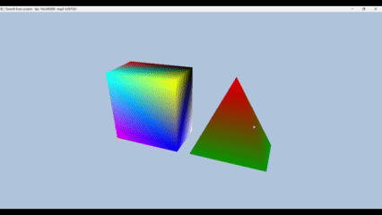

# Introduction to 3D Game Programming with DirectX 12 (Exercises)

## Chapter 6 Drawing in Direct3D

Topics Covered in this chapter include:
* Book's data structures for storing geometric data
	* The author has created helper classes to quickly create vertex data for common shapes
* Writing vertex and pixel shaders in HLSL
	* The Vertex shader is the first (programmable) stage of the shader pipeline and runs once for each vertex fed from the Input Assembler (IA) stage.
* What Pipeline State Objects (PSOs) are
	* Pipeline State Objects define the shaders used at a given point in the rendering.
	* During rendering, different rendered objects require different shaders. PSOs bundle the required shaders for a given item or set of items, and you switch the required PSO before the draw call of the items.
	* Proper batching of similarly-drawn items, can reduce frequent switching between PSOs, which has small performance cost.
* Create and bind constant buffer data to the pipeline
	* Constant buffers are one means of feeding data into the GPU where the shader code runs.
	* They are best used for commonly used data items, like the player camera transform and other shader "globals".
* What root signatures are and how to create them
	* Root signatures define the shape of the data that the shader can expect to recieve during the draw call.
	* Root signatures are made up of root parameters, which come in the three varieties: root descriptors, root constants, and root descriptor tables.
	* GPU data buffers can be reinterpeted in different ways, depending on how the root signature describes them.

## Exercises

### 4

"Construct the vertex and index list of a pyramid ...and draw it. Color the base vertices green and the tip vertex red." - pg. 261

### 6

"""

Modify the Box demo by applying the following transformation to each vertex shader prior to transforming to world space.

vin.PosL.xy += 0.5f*sin(vinL.Pos.x)*sin(3.0f*gTime);
vin.PosL.z += 0.6f + 04f*sin(2.0f*gTime);

You will need to add a gTime constant buffer variable; this variable corresponds to the current GameTimer::TotalTime() value. This will animate the vertices as a function of time...

"""
- pg. 262

### 7

"""

Merge the vertices of a box and pyramid (Exercse 4) in one large vertex buffer. Also merge the indices of the box and pyramid into one large index buffer (but do not update the index values). Then draw the box and pyramid one-by-one using the parameter of ID3D12CommandList::DrawIndexedInstanced. Use the world transformation matrix so that the box and pyramid are disjoint in world space.

""" - pg. 262

## Result

## Getting Started

* Clone the repo. 
* Open repo in Visual Studio.
* Navigate to the branch you wish to view.
* Click "Play" button to start solution.

### Prerequisites

* A 64-bit machine
* Windows 10 (or later)
* Visual Studio 2015 (or later)

## License

This project is licensed under the MIT License - see the [LICENSE.md](LICENSE.md) file for details

## Acknowledgments

* Luna, Frank D. Introduction to 3D Game Programming with DirectX 12. Mercury Learning and Information, 2016.

## Companion Study Tools

### Flashcard App
While going through the book, I created flash cards to remember the concepts and code.
You can find the raw JSON flash cards here:
* https://github.com/jamiejamiebobamie/flashcardApp/tree/master/src/SimulatedResponse/CardData/DirectX12

Feel free to clone the repo and use the app for your studies. The app has related topics such as Linear Algebra and Trigonometry.
* https://github.com/jamiejamiebobamie/flashcardApp
