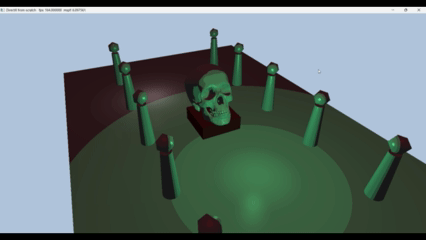
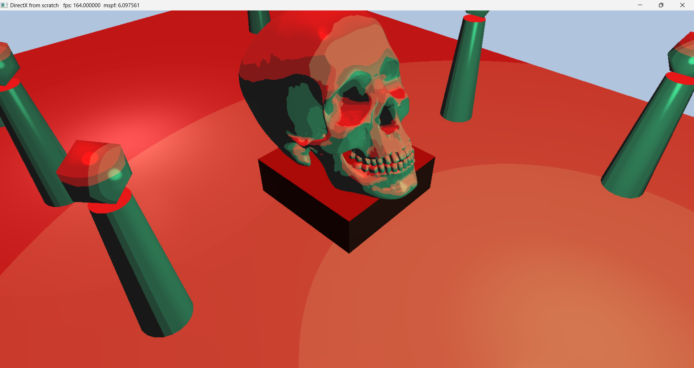

# Introduction to 3D Game Programming with DirectX 12 (Exercises)

## Chapter 8 Lighting

Topics Covered in this chapter include:
* How lighting works in the real world
	* Light is both a wave and a particle. In computer graphics, light is generally treated as a wave, represented as a geometric vector.
* What is the difference between local illumination and global illumination
	* Both are lighting models, or ways of lighting a 3D scene. 
	* Global illumination takes into account reflected light that repeatedly bounces off objects in the scene.
	* Local illumination is a lighting model that does not try to faithfully or accurately model reflected light. It only takes into account light that comes directly from a light source and strikes an object.
	* Global illumination is not generally present in video games due to processing limitations.
	* The lighting model featured in this book is local illumination.
	* Ambient light is represented in the lighting equation as a constant term, which is a simplification of the global illumination model. The effect of the ambient term in the lighting equation is to simply "brighten" everything in the scene.
* How to mathematically represent a surface normal and how surface normals are used in lighting equations
	* A surface normal, is a normalized vector that represents the direction a given point on a surface is "facing."
	* A surface normal is like a flag pole that shoots-up perpindicularly from the ground, following the curvature of the surface.
	* Surface normals are important in lighting equations.
		* Surfaces that are facing a light source will be brighter.
		* Surfaces with a surface normal facing away from a light source can be ignored.
		* For shiny surfaces that have a specular highlight due to refraction, the surface normal will determine how much specular light is reflected. (Think a setting sun on the ocean. The larger the angle of incidence of the light on the surface (from 0 degrees to 90 degrees), the more light is reflected in the Fresnel questions.)
* How to transform normal vectors
	* Sometimes, an object will have a non-uniform transformation applied to it (like a "shear" scaling). This same transformation matrix when applied to the normal vectors of the object, will "de-normalize" it.
	* When applying a non-unform transformation to an object, to transform the object's normal vectors, use the inverse transpose of the transformation matrix. DirectXMath has a function to do this for you: XMMatrixInverseTranspose.
* What is ambient, diffuse, and specular lighting
	* Ambient light is a environmental light that has bounced infinitely off scene geometry and is now reflected to a specific point being considered on a object. It is represented in the lighting equation as a constant term.
	* Diffuse light is light that hits an opaque object. Some of the light is absored by the object, some is reflected. How much light is absorbed and how much is reflected is dependent on the materials (and color) of the object. This light that is reflected is diffuse light. It is considered for a given point on an object using the Lambertian reflection model, which is based on the angle of incidence of the light on the surface.
	* Specular light is light that hits a shiny surface and is reflected in a specific direction as a function of the viewing angle and the surface's material. Smooth vs. rough surfaces are smooth or rough due to "micro-normals", these are microscropic surface normals that reflect light uniformly (smooth) or nonuniformly (rough). Specular light can create a specular highlight or "lobe" that essentially relfects all of the light source towards the viewer like a mirror. This is called the Fresnel effect.
* How to implement directional, point, and spot lights
	* Directional lights are represented simply as normalized vectors, as they represent light so far away that all of the light rays are parallel to one another. They are often used to simulate the sun.
	* Point lights are represented by a location in the scene, as well as a "falloff" start and end, to represent the light's radius and how abruptly the light dissiapates. 
	* Spot lights are represented by a location, a direction, a fall off start and end, as well as "SpotPower" which controls the light's intensity relative to the distance from spotlight.
	* All lights have a color, represented as a 3D-vector, RGB, with each field normalized to [0.0, 1.0]. White light is represented as [1.0,1.0,1.0]. Black light is [0.0,0.0,0.0].
* How to implement "attenuation parameters" to control light intensity over distance
	* Attentuation is handled with this equation in the shader: saturate((falloffEnd - distance) / (falloffEnd- falloffStart))
	* "saturate" is an HLSL built-in that clamps the first parameter to second (min) and third (max), inclusive. If no 2nd and 3rd params are passed, it defaults to 0.0 and 1.0.

## Exercises

### 1

"Modify the lighting demo ...so that the directional light only emits mostly red light. In addition, make the strength of the light oscillate as a function of time using the sine function so that the light appears to pulse..." - pg. 357

### 2

"Modify the lighting demo of this chapter by changing the roughness in the materials." - pg. 357

### 3

"Modify the Shapes demo ...by adding materials and a 3-point lighting system. The three-point lighting system ...consists of a primary light source called the key light, a seconary fill light usually aiming in the side direction of the key light, and a back light. ...three-point lighting [is] a way to fake indrect lighting ...gives better object definition than just using the ambient component for indirect lighting. Use three directional lights for the three-point lighting system." - pg. 357

### 4

"Modify the solution to Exercise 3 by removing the three-point lighting, and adding a point centered about each sphere above the columns." - pg. 358

### 5

"Modify the solution to Exercise 3 by removing the three-point lighting, and adding a spotlight centered about each sphere above the columns and aiming down." - pg. 358

### 6

"...cartoon styled lighting is the abrupt transition from one color shade to the next (in contrast with a smooth transition) ...Modify the lighting demo of this chapter to use this sort of toon shading." - pg. 358

## Result

## Getting Started

* Clone the repo. 
* Open repo in Visual Studio.
* Navigate to the branch you wish to view.
* Click "Play" button to start solution.

### Prerequisites

* A 64-bit machine
* Windows 10 (or later)
* Visual Studio 2015 (or later)

## License

This project is licensed under the MIT License - see the [LICENSE.md](LICENSE.md) file for details

## Acknowledgments

* Luna, Frank D. Introduction to 3D Game Programming with DirectX 12. Mercury Learning and Information, 2016.

## Companion Study Tools

### Flashcard App
While going through the book, I created flash cards to remember the concepts and code.
You can find the raw JSON flash cards here:
* https://github.com/jamiejamiebobamie/flashcardApp/tree/master/src/SimulatedResponse/CardData/DirectX12

Feel free to clone the repo and use the app for your studies. The app has related topics such as Linear Algebra and Trigonometry.
* https://github.com/jamiejamiebobamie/flashcardApp
