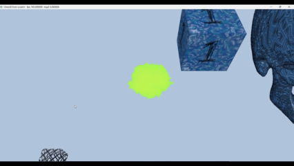

# Introduction to 3D Game Programming with DirectX 12 (Exercises)

## Chapter 9 Texturing

Topics Covered in this chapter include:
* How are textures mapped to a geometry's surface?
    * A texture is 2D image of RGB values.
    * A geometry is made-up of triangle faces that share vertices and edges.
    * At each triangle vertex, there is a texture coordinate, specified as 'u' and 'v', 'u' being the traditional horizontal or 'x' part in a Catesian coordinate system, and 'v' being the vertical or 'y' part in the a Cartesian coordinates, except the origin of the system begins in the top-left coordinate and extend downward to the bottom right, so positive 'v' values go downward. Also uv coordinates are normalized from [0, 1].
    * During rasterization, the uv coordinates hard-coded at each vertex are interpolated across the edges and faces of a given triangle, so that in the pixel shader, each pixel has a unique uv-texture coordinate it can use to sample the given texture.
    * HLSL provides a 'Sample' method on the texture object to sample the texture for that given pixel.
    * Using the texture coorindates and bilinear sampling, the correct RGB color can be found.
* How to make and use textures in the DirectX12?
    * Textures are created in an image software such as Photoshop and then exported as DDS file. DDS (DirectDraw Surface) files are optimal as they are "natively understood by the GPU" in DirectX12 and can be "natively decompressed by the GPU." DDS files also support features important games likes mipmaps, cube maps, texture arrays, etc.
    * Import your DDS files with the DirectX12 helper function: 'CreateDDSTextureFromFile12'.
    * To get the texure into the pixel shader, you need to bind them to a Descriptor Heap (the memory backing, ie. where the texture is stored), and then describe them a with an SRV (shader resource view) Descriptor.
    * During the draw call, bind the required descriptor heap, so the correct texture is used.
* How can textures be filtered to create a smoother image?
    * Inside the shader, when calling the built-in HLSL "Sample" method, you need to specify a "Sampler" to use. Samples tell the Sample method how you want to Sample the texture. There are several options, but these need to be intialized, specified, and bound prior to render time (during intialization).
    * Static Samplers are a special DirectX12 shortcut, to using samplers without a descriptor heap that is useful when you only need a couple textures for your applcation.
    * Aniostropic filtering (specified in a Sampler) is the best filtering method, but also the most expensive. It allows textures to be viewed at an oblique angle (think eye level with a tabletop) with minimum warping.
* What are Address Modes?
    * Address Modes are specified in the Sampler object and determine what happens when a uv coordinate is outside the bounds of [0.0, 1.0]. Some example address modes are mirror, wrap, clamp, etc.

## Exercises

### 1

"Experiment with the "Crate" demo by hcnaging the texture coordinates and using different address mode combinations and filtering options. In particular, reproduce the images in Figures 9.7, 9.9, 9.10, 9.11, 9.12, and 9.13" - pg. 394

### 2

"Using DirectX Texture Tool, we can manually specify each mipmap level... Create a DDS file with a mipmap chain like the one in Figure 9.17, with a different texutal description or color on each level so that you can easily distinguish between each mipmap level. Modify the Crate demo by using this texture and have the camera zoom in and out so that you can explicitly see the mipmap levels changing. Try both point and linear mipmap filtering." - pg. 394

NOTE: Point filtering for mipmaps causes the textures to "pop-in" when the specified distance or breakpoint is reached. Linear filtering is a smooth transition between mip levels. This is present in the gif below.

### 3

"Given two textures of the same size, we can combine them via different operations to obtain a new image. More generally, this is called multitexturing, where multiple textures are used to achieve a result. For example, we can add, subtract, or (component-wise) multiply the corresponding texels of two textures. ...modify the "Crate" demo by combining the two source textures in Figure 9.18 in a pixel shader to produce the fireball texture over each cube face." - pg. 395

## Result

## Getting Started

* Clone the repo. 
* Open repo in Visual Studio.
* Navigate to the branch you wish to view.
* Click "Play" button to start solution.

### Prerequisites

* A 64-bit machine
* Windows 10 (or later)
* Visual Studio 2015 (or later)

## License

This project is licensed under the MIT License - see the [LICENSE.md](LICENSE.md) file for details

## Acknowledgments

* Luna, Frank D. Introduction to 3D Game Programming with DirectX 12. Mercury Learning and Information, 2016.

## Companion Study Tools

### Flashcard App
While going through the book, I created flash cards to remember the concepts and code.
You can find the raw JSON flash cards here:
* https://github.com/jamiejamiebobamie/flashcardApp/tree/master/src/SimulatedResponse/CardData/DirectX12

Feel free to clone the repo and use the app for your studies. The app has related topics such as Linear Algebra and Trigonometry.
* https://github.com/jamiejamiebobamie/flashcardApp
