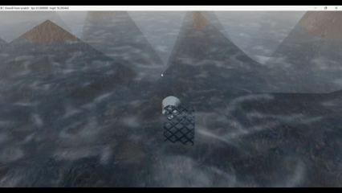

# Introduction to 3D Game Programming with DirectX 12 (Exercises)


## Chapter 10 Blending

Topics Covered in this chapter include:
* How does blending work in DirectX12 and how do you use it?
	* Blending in Computer Graphics is combining two pixels together to create a blend between them. It is used in Computer Graphics to implement semi-transparent materials such as windows and glass, where the pixel color behind the glass needs to be blended with the glass pixel.
	* DirectX12 Blend Factors are how programmers specify the blend operation that occurs between a source and destination pixel.
	* The blend function is C = Csrc ⨷ Fsrc (blend or logic operator) Cdst ⨷ Fdst,  A =  Asrc * Fsrc (blend or logic operator) Adst * Fdst, where ⨷ is component-wise multiplcation, and C is the color, F is the Blend Factor, and the bitwise operation is a Logic operator that defines the blend.
	* The source and destination blend factors as well as the blend/logic operator for the blend are specified in the Pipeline State Object 'BlendState' field for a given Render Target.
	* The blend operators include: add, subtract, min, max, etc.
	* The logic operators include: set, copy, and, nand, etc.
	* Blending of alpha and RGB components of the src and destination colors are handled independently (ie. alpha and alpha with color and color).
* What are some of the important Blend options on the BlendState object in the PSO?
	* AlphaToCoverageEnable: enables "alpha-to-coverage" multisampling technique, which allows for a more natural "blended" look for geometry and textures that use Alpha to hide large parts of the geometry, for example with leaves and gates. Without this option, the cut-off point between 0 Alpha and 1 Alpha will look choppy.
	* IndependentBlendEnable: Allows you to specify and use the BlendState specified on each RenderTarget. Without this set to true, the other RenderTargets will default to the first RenderTargets' blend options even if specified!
	* RenderTarget: Use to specify the blend options for other RenderTargets.
* How do you enable the Alpha component of a texture to control the transparency of mesh? What are the Blend options to implement this?
	* Blend the src and dest pixels based on the opacity of the src pixel.
	* Source blend factor should be D3D12_BLEND_SRC_ALPHA, the destination blend factor should be D3D12_BLEND_INV_SRC_ALPHA, and the blend operator should be D3D12_BLEND_OP_ADD.
	* This creates this equation: C = (a_src * Csrc) + (1 - a_src) * Cdst.
	* One caveat with this approach: if you have multiple transparent meshes overlapping on the screen, the transparent meshes need to be sorted correctly when drawing them, with the farthest mesh in the background first and the closest one to the viewer last. Even after doing this there may still be issues if the geometry is complex and there is not a clear spatial ordering.
* How do you reject a pixel completely in the pixel shader, for example when drawing a leaf?
	* HLSL has a built-in "clip" function that rejects the pixel if the input to the function is less than 0.

## Result



### PSO descriptor for the transparent water shader:
```
	D3D12_GRAPHICS_PIPELINE_STATE_DESC transparentPsoDesc = opaquePsoDesc;

	D3D12_RENDER_TARGET_BLEND_DESC transparencyBlendDesc;
	transparencyBlendDesc.BlendEnable = true;
	transparencyBlendDesc.LogicOpEnable = false;
	transparencyBlendDesc.SrcBlend = D3D12_BLEND_SRC_ALPHA;
	transparencyBlendDesc.DestBlend = D3D12_BLEND_INV_SRC_ALPHA;
	transparencyBlendDesc.BlendOp = D3D12_BLEND_OP_ADD;
	transparencyBlendDesc.SrcBlendAlpha = D3D12_BLEND_ONE;
	transparencyBlendDesc.DestBlendAlpha = D3D12_BLEND_ZERO;
	transparencyBlendDesc.BlendOpAlpha = D3D12_BLEND_OP_ADD;
	transparencyBlendDesc.LogicOp = D3D12_LOGIC_OP_NOOP;
	transparencyBlendDesc.RenderTargetWriteMask = D3D12_COLOR_WRITE_ENABLE_ALL;

	transparentPsoDesc.BlendState.RenderTarget[0] = transparencyBlendDesc;
	ThrowIfFailed(md3dDevice->CreateGraphicsPipelineState(&transparentPsoDesc, IID_PPV_ARGS(&mPSOs["transparent"])));
```
### PSO descriptor for the alpha-tested metal box shader:
```
	D3D12_GRAPHICS_PIPELINE_STATE_DESC alphaTestedPsoDesc = opaquePsoDesc;
	alphaTestedPsoDesc.PS =
	{
		reinterpret_cast<BYTE*>(mShaders["alphaTestedPS"]->GetBufferPointer()),
		mShaders["alphaTestedPS"]->GetBufferSize()
	};
	alphaTestedPsoDesc.RasterizerState.CullMode = D3D12_CULL_MODE_NONE;
	ThrowIfFailed(md3dDevice->CreateGraphicsPipelineState(&alphaTestedPsoDesc, IID_PPV_ARGS(&mPSOs["alphaTested"])));
```
### Pixel shader showing the alpha-test to clip parts of the metal box:
```
float4 PS(VertexOut pin) : SV_Target
{

...

#ifdef ALPHA_TEST
	// Discard pixel if texture alpha < 0.1.  We do this test as soon 
	// as possible in the shader so that we can potentially exit the
	// shader early, thereby skipping the rest of the shader code.
	clip(diffuseAlbedo.a - 0.1f);
#endif

 ...

    return litColor;
}
```
## Getting Started

* Clone the repo. 
* Open repo in Visual Studio.
* Navigate to the branch you wish to view.
* Click "Play" button to start solution.

### Prerequisites

* A 64-bit machine
* Windows 10 (or later)
* Visual Studio 2015 (or later)

## License

This project is licensed under the MIT License - see the [LICENSE.md](LICENSE.md) file for details

## Acknowledgments

* Luna, Frank D. Introduction to 3D Game Programming with DirectX 12. Mercury Learning and Information, 2016.

## Companion Study Tools

### Flashcard App
While going through the book, I created flash cards to remember the concepts and code.
You can find the raw JSON flash cards here:
* https://github.com/jamiejamiebobamie/flashcardApp/tree/master/src/SimulatedResponse/CardData/DirectX12

Feel free to clone the repo and use the app for your studies. The app has related topics such as Linear Algebra and Trigonometry.
* https://github.com/jamiejamiebobamie/flashcardApp
