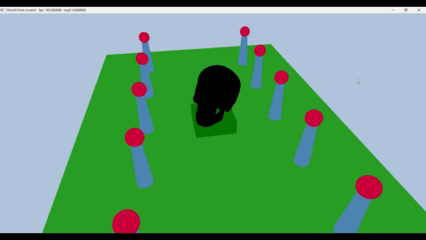

# Introduction to 3D Game Programming with DirectX 12 (Exercises)

## Chapter 7 Drawing in Direct3D Part II

Topics Covered in this chapter include:
* Understanding how to render objects without "flushing the command queue"
	* The GPU runs the shader code which determines how geometry is rendered.
	* Other than the shader code, the GPU is not directly programmable/interactable.
	* To control the GPU, we issue commands using the command queue, which is a FIFO queue of commands that the GPU executes in order.
	* The GPU and CPU are like two different people working together, each with different tasks that are best suited for their abiltiies.
	* A performant system will have the CPU and GPU outputting as much work as they are able to manage, without one getting too far ahead or behind of the other.
	* The command "FlushCommandQueue" clears the command queue of all commands, at the end of every frame before continuing to the next frame.
	* This command is convenient and usable for small projects, but it is not effiecient as both the GPU and CPU will be waiting for the other at different points.
		* The GPU will wait at the beginning of the frame as it waits for commands.
		* The CPU will wait at the end of the frame as the GPU finishes executing commands.
	* FIX: The author creates a data structure called a "Frame Resource" that has all of the data required for a given frame.
	* Using this fix, the CPU prepares all of the data for (at most) 3 frames in advance, so that the GPU is never waiting and the CPU can happily go as fast as it can by building frames in advance.
* Learn about root descriptors and root constants (the other two types of root parameters).
	* Root descriptors are lightweight descriptors that are stored directly in the root signature. They do not require the indrection of a memory backing (a la a descriptor heap).
	* Descriptor heaps are used to store descriptors for resources that are not known at compile time, such as textures and buffers.
* Use more of the author's Shapes class
* How to animate vertices in the CPU and how to feed those updated vertex positions to the GPU for rendering
	* The author creates a data structure called "Object Constants" that store the object data for a given render item. This data structure is stored in a constant buffer and is updated every frame for each render item. 

## Exercises

### 1

"Modify the "Shapes" demo to use GeometryGenerator::CreateGeosphere instead of GeometryGenerator::CreateSphere. Try with 0, 1, 2, and 3 subdivision levels." - pg. 313

### 2

"Modify the "Shapes" demo to use sixteen root constants to set the per-object world matrix instead of a descriptor table." - pg. 313

### 3

"...modify the "Shapes" demo to load and render the skull mesh." - pg. 313

## Result

## Getting Started

* Clone the repo. 
* Open repo in Visual Studio.
* Navigate to the branch you wish to view.
* Click "Play" button to start solution.

### Prerequisites

* A 64-bit machine
* Windows 10 (or later)
* Visual Studio 2015 (or later)

## License

This project is licensed under the MIT License - see the [LICENSE.md](LICENSE.md) file for details

## Acknowledgments

* Luna, Frank D. Introduction to 3D Game Programming with DirectX 12. Mercury Learning and Information, 2016.

## Companion Study Tools

### Flashcard App
While going through the book, I created flash cards to remember the concepts and code.
You can find the raw JSON flash cards here:
* https://github.com/jamiejamiebobamie/flashcardApp/tree/master/src/SimulatedResponse/CardData/DirectX12

Feel free to clone the repo and use the app for your studies. The app has related topics such as Linear Algebra and Trigonometry.
* https://github.com/jamiejamiebobamie/flashcardApp
